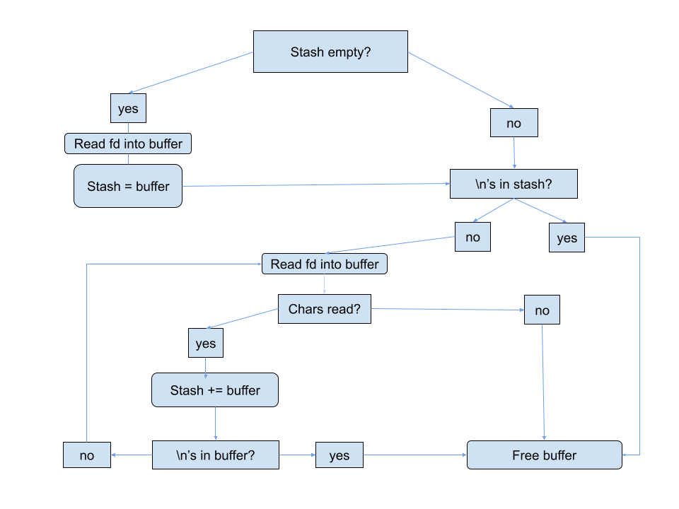

<h1 align="center">
	📖 Get Next Line
</h1>
<h2 align="center">
	42 Lisbon Cursus - December 2022
</h2>

  

	
	
	
	

## Summary
This project is about programming a function that returns a line
read from a file descriptor.

## Subject
[📗️](en.subject.pdf) 

### External Functions Used

- read()  
- malloc()
- free()

### The function works by the grace of God and because I implemented the following logic: 

